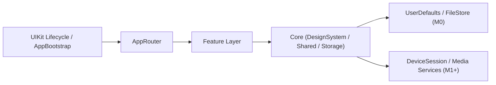

# Cam360技术架构文档

- 文档版本：v3.1
- 更新时间：2026-04-16
- 文档状态：阶段性约束版（M0 已完成，M1+ 规划中）
- 适用范围：基于设备热点 AP 模式连接的 iOS 行车记录仪 App

## 1. 文档目标

本文档用于约束当前仓库后续演进，保留核心架构决策、模块边界和阶段目标。

**当前仓库已完成 M0 阶段**，具备以下基础骨架：
- UIKit 生命周期桥接 + SwiftUI 根视图
- `AppBootstrap` / `AppRouter` / `AppContainer`
- 主界面 4-tab 骨架
- 最小 DesignSystem
- 本地偏好与已知设备存储
- 最小单元测试与 UI 冒烟测试

**本文档不覆盖 M1+ 的详细设计**，相关章节已标记为"规划中，待补充"。

## 2. 项目假设与技术基线

### 2.1 业务假设

- 行车记录仪通过设备热点 AP 模式供 App 连接
- App 在连接设备后主要通过局域网与设备通信，而非公网 API
- "连上设备热点"不等于"设备已可控制"，两者必须拆开建模
- 实时预览、回放、下载、设置均依赖统一的设备会话能力
- 文件下载后保存到本地沙盒，用户可选择导出到系统相册或分享

### 2.2 技术基线

- 开发语言：Swift
- 最低支持版本：iOS 13
- 平台策略：主路径以 iOS 15 写法和可用 API 为主，iOS 17+ 能力按 `#available` 隔离增强
- UI 框架：SwiftUI 为主，UIKit 生命周期桥接
- 开发方法：TDD（核心业务、状态机、命令路由默认先写测试再实现）
- 并发模型：业务副作用优先使用 Swift Concurrency（`async/await`、`Task`、`actor`）
- 状态模型：`ObservableObject`、`@Published`、`@ObservedObject`、`@State`
- 单元测试：Swift Testing
- UI 测试：XCTest / XCUITest
- 本地持久化：`UserDefaults` + App Sandbox 文件系统

### 2.3 明确不采用

- 不默认引入完整 Clean Architecture 分层模板
- 不默认引入第三方 DI 框架
- 不以 Combine 作为新业务并发主方案
- 不默认引入 SwiftData 作为当前阶段基础设施
- 不为"通用性"引入大量空协议、基类和中间层

## 3. 架构总览

本项目采用 **Feature-first + SwiftUI + AppRouter/AppContainer + Core/Storage** 的轻量分层架构。



## 4. 核心架构决策

### 4.1 Feature-first，而不是纯 Views / ViewModels 目录平铺

按功能拆分的目录方式，公共能力下沉到 `Core`。

### 4.2 保留 AppRouter 收口根级导航

- `AppRouter`：管理根级导航、Tab、全局弹窗、深链
- `AppBootstrap`：决定首次启动分流
- `AppContainer`：组合当前阶段的仓库与 Feature Store

### 4.3 不做重型 Clean Architecture

只保留必要的分层边界：View、Feature Store、Service/UseCase、Repository/Transport。

仅在跨 Feature 复用、测试价值高、边界稳定时才抽 `UseCase`。

### 4.4 设备会话在 M1+ 必须单点收口

规划中（M1+），详见"里程碑拆分"章节。

## 5. 目录结构

```text
Cam360/
├── App/
│   ├── AppRouter.swift
│   ├── AppContainer.swift
│   ├── AppBootstrap.swift
│   ├── AppRootView.swift
│   ├── MainTabView.swift
│   ├── AppDelegate.swift
│   └── SceneDelegate.swift
├── Core/
│   ├── DesignSystem/
│   ├── Shared/
│   ├── Storage/
│   └── Device/          (M1+ 预留)
├── Features/
│   ├── Dashboard/
│   ├── Gallery/
│   ├── Events/
│   ├── Settings/
│   └── DeviceOnboarding/
├── Resources/
├── Cam360Tests/
└── Cam360UITests/
```

每个 Feature 内部默认最小结构：`FeatureView.swift` + `FeatureStore.swift` + `FeatureRoute.swift`（可选 `Components/`）。

## 6. 分层与边界

| 层级 | 职责 | 不负责 |
|------|------|--------|
| App | 生命周期、根路由、全局依赖注册 | 业务流程细节、设备连接实现 |
| Feature | 页面渲染、用户动作处理、UI 状态管理 | 维护底层设备会话、持有长生命周期连接 |
| Core | 跨 Feature 复用的稳定薄能力 | 页面编排 |

**状态归属**：
- 瞬时 UI 状态 → Feature Store
- 本地持久化状态 → UserDefaults / FileStore
- 设备运行态 → M1+ DeviceSession（规划中）
- 媒体运行态 → M1+ LivePreviewService / PlaybackService（规划中）

## 7. 核心功能模块（规划中）

以下模块的详细设计（M1+）待补充：

- **DeviceOnboarding**：热点接入引导、权限说明、连接后校验、失败分流
- **DeviceList**：已知设备展示、连接记录、设备选择入口
- **LivePreview**：实时预览画面、预览控制、状态显示
- **Playback**：录像列表、时间轴浏览、片段播放
- **Downloads**：下载任务管理、进度展示、导出能力
- **Settings**：设备参数读写、本地偏好设置

## 8. 设备接入架构（规划中）

M1+ 接入链路规划如下（详细设计待补充）：

### 8.1 接入流程（5 阶段）

1. 准备阶段
2. 连接热点
3. 连接后校验
4. 进入设备会话
5. 失败恢复

### 8.2 接入配置清单

- `Hotspot Configuration` capability
- `NSLocalNetworkUsageDescription`
- 若使用 Bonjour 发现设备，补 `NSBonjourServices`

### 8.3 接入设计原则

- UI 必须明确区分"已连热点"和"设备已可控制"
- 所有失败都要映射到用户可操作的路径

## 9. DeviceSession 状态机（规划中）

M1+ 目标：统一 `DeviceSession` 作为唯一权威状态源。

规划状态：`idle` → `apConnecting` → `handshaking` → `ready` → `busy` / `recovering` / `failed` / `disconnected`

详细设计待补充。

## 10. 导航与依赖注入

### 10.1 导航

- 首次安装或无设备记录：进入 `DeviceOnboarding`
- 已有设备：进入主界面

主界面 Tab：
- `dashboard` - 设备总览、快捷动作和预览入口
- `gallery` - 回放、下载和媒体列表入口
- `events` - 事件列表
- `settings` - 设置

### 10.2 依赖注入

采用手写依赖注入，不引入 DI 框架。

`AppContainer` 当前负责创建和组合：
- `KnownDeviceRepository`
- `AppPreferenceStore`
- 各 Feature Store

## 11. 第三方依赖策略

默认最小化第三方依赖：

- `SwiftGen`：可用，用于资源与本地化强类型访问
- `Lottie`：仅在设计明确需要动画资源时引入

默认不引入：
- 通用 UI Kit
- Toast / Popup 框架
- Navigation / Coordinator UI 框架
- Form / Input 组件集

## 12. 设计系统

保持最小集合：
- 语义化颜色
- 字体层级
- 间距系统
- 圆角与阴影规范
- 深色模式

不要在项目初期过度建设"通用组件库"，优先完成业务闭环。

### 12.1 UI Tokens

- 颜色：主色、成功、警告、错误、文本主次级、背景分层、边框
- 字体：页面标题、区块标题、正文、说明、按钮、标签
- 间距：`4 / 8 / 12 / 16 / 20 / 24 / 32`
- 圆角：小、中、大、卡片、弹层
- 阴影：卡片阴影、浮层阴影
- 图标尺寸：小、中、大三档

### 12.2 通用交互规范

- 导航栏统一为三种样式：Standard / LargeTitle / ImmersiveMedia
- 弹窗统一：`.alert`（阻断确认）、`.confirmationDialog`（动作选择）
- Toast 仅用于非阻断反馈，默认自动消失
- Sheet 用于次级流程，不在 sheet 中塞长链路业务流程
- 权限申请统一为独立页面样式

### 12.3 最小组件清单

基础组件：`PrimaryButton` / `SecondaryButton` / `TertiaryButton` / `DestructiveButton` / `IconButton`

业务列表组件：`DeviceCell` / `RecordingCell` / `DownloadCell` / `SettingCell`

反馈组件：`InlineLoadingView` / `FullScreenLoadingView` / `EmptyStateView` / `ErrorStateView` / `ToastView` / `PermissionPageView`

### 12.4 深色模式实现

颜色统一使用 Asset Catalog 管理，路径：`Cam360/Assets.xcassets/<ColorName>.colorset/`

**颜色集结构**：
```text
Assets.xcassets/
├── Brand.colorset/
│   └── Contents.json  (单一颜色，无需亮暗区分)
├── TextPrimary.colorset/
│   └── Contents.json  (包含 light/dark 双版本)
└── ...
```

**命名规范**：
| Asset 名称 | 用途 |
|-----------|------|
| `Brand` | 主色调 |
| `Success` | 成功状态 |
| `Warning` | 警告状态 |
| `Danger` | 危险/错误状态 |
| `TextPrimary` | 主要文本 |
| `TextSecondary` | 次要文本 |
| `AppBackground` | 页面背景 |
| `Surface` | 卡片/组件背景 |
| `SurfaceMuted` | 次级表面 |
| `Border` | 边框/分割线 |
| `TabInactive` | 未激活 Tab |
| `AccentSurface` | 强调区域背景 |
| `DangerSurface` | 错误状态背景 |

**开发规范**：
- 所有 UI 颜色必须使用 `AppColor.xxx`，禁止硬编码 `Color.white` / `Color.black`（阴影除外）
- 阴影颜色可保留 `Color.black.opacity(xxx)`，因为阴影本身是深度效果
- 系统会自动根据 `preferredColorScheme` 或设备设置切换亮暗模式，无需手动处理

**十六进制颜色支持**：
- Asset Catalog 只支持 RGB 分量格式，不支持直接写 `#236EFF`
- 提供 `Color+Hex.swift` extension，支持 `Color(hex: "#236EFF")`
- 推荐做法：颜色配到 Asset Catalog 双版本中；仅在快速原型或临时场景使用 hex

## 13. 测试与验证口径

### 13.1 TDD 原则

- 核心业务逻辑采用 TDD：Red -> Green -> Refactor
- 修复 bug 时，先补复现测试，再修实现
- 重构前必须有护栏测试

### 13.2 当前优先覆盖

- `AppBootstrap` 启动分流
- `AppRouter` 路由切换
- 本地 Repository / Store 读写

### 13.3 UI 冒烟测试

最小路径：
1. 首次进入 App，显示 `DeviceOnboarding`
2. 强制进入主界面并完成四个主 Tab 切换

## 14. 里程碑拆分

### M0：项目脚手架 ✅ 已完成

交付物：App 入口、Router、AppContainer、Core 基础目录、设计系统最小骨架

### M1：设备接入与会话 🚧 规划中

交付物：AP onboarding、连接后校验、DeviceSession、基础错误分流

### M2：实时预览 🚧 规划中

交付物：LivePreview Feature、预览服务、基本状态展示

### M3：回放 🚧 规划中

交付物：录像列表、时间轴、回放服务

### M4：下载与导出 🚧 规划中

交付物：下载任务管理、本地文件保存、导出能力

### M5：设置与稳定性收口 🚧 规划中

交付物：设备设置页、本地偏好页、错误诊断页、关键链路测试补齐

## 15. 总结

本项目的落地重点：

- 先维持当前主骨架、目录和测试口径稳定
- 再把 AP 接入、设备会话、实时预览、回放、下载、设置按既定边界逐步接入
- 用最小但清晰的目录、依赖和测试策略支撑后续迭代

**本文档变更记录**：
- v3.1（2026-04-16）：新增 §12.4 深色模式实现规范，颜色统一使用 Asset Catalog 管理
- v3.0（2026-04-16）：精简文档，移除 M1+ 详细设计，标记为"规划中待补充"
- v2.1（前期版本）：完整技术架构文档
