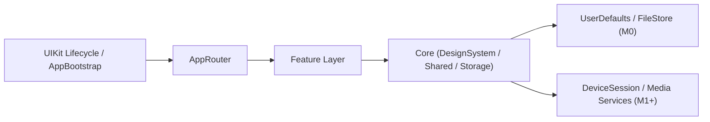
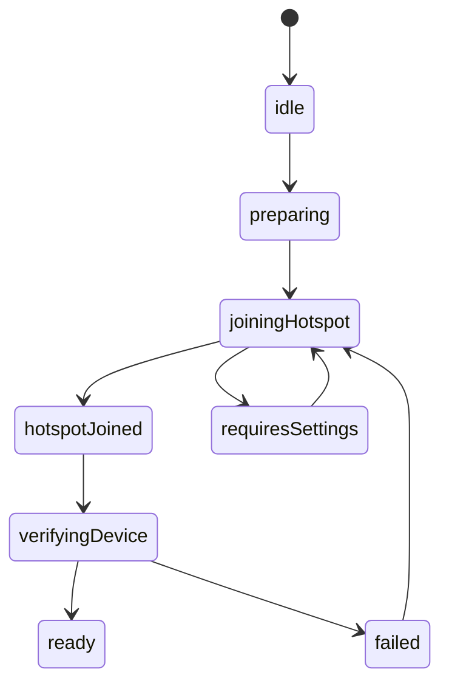

# Cam360技术架构文档

- 文档版本：v2.1
- 更新时间：2026-04-16
- 文档状态：阶段性约束版（M0 已基本完成，M1+ 待接入）
- 适用范围：基于设备热点 AP 模式连接的 iOS 行车记录仪 App

## 1. 文档目标

本文档用于约束当前仓库后续演进，保留仍然有效的核心架构决策、模块边界和阶段目标，不再承担完整的从 0 到 1 实施说明。

当前仓库已具备以下基础骨架：

- UIKit 生命周期桥接 + SwiftUI 根视图
- `AppBootstrap` / `AppRouter` / `AppContainer`
- 主界面与主要 Feature 骨架
- 最小 DesignSystem
- 本地偏好与已知设备存储
- 最小单元测试与 UI 冒烟测试

本文档继续明确以下内容：

- 功能边界
- 模块拆分
- 状态归属
- 依赖注入方式
- 设备接入链路
- 测试与验收方式

本文档默认面向一个以本地设备控制为主的 App，核心能力包括：

- 设备接入与连接恢复
- 实时预览
- 回放与时间轴浏览
- 文件下载与导出
- 设备设置与本地偏好设置

本文档不覆盖以下内容：

- 设备固件设计
- 音视频编解码底层实现
- 云端账号体系
- 服务端架构
- 视频编辑器等二期能力

## 2. 项目假设与技术基线

### 2.1 业务假设

- 行车记录仪通过设备热点 AP 模式供 App 连接
- App 在连接设备后主要通过局域网与设备通信，而非公网 API
- “连上设备热点”不等于“设备已可控制”，两者必须拆开建模
- 实时预览、回放、下载、设置均依赖统一的设备会话能力
- 文件下载后保存到本地沙盒，用户可选择导出到系统相册或分享

### 2.2 技术基线

- 开发语言：Swift
- 最低支持版本：iOS 13
- 平台策略：主路径以 iOS 15 写法和可用 API 为主，iOS 17+ 能力按 `#available` 隔离增强
- UI 框架：SwiftUI 为主，UIKit 生命周期桥接
- 开发方法：TDD（核心业务、状态机、命令路由默认先写测试再实现）
- 并发模型：业务副作用优先使用 Swift Concurrency（`async/await`、`Task`、`actor`）
- 状态模型：当前以 `ObservableObject`、`@Published`、`@ObservedObject`、`@State` 为主
- 单元测试：Swift Testing
- UI 测试：XCTest / XCUITest
- 本地持久化：M0 以 `UserDefaults` 承载已知设备与偏好；大文件继续走 App Sandbox 文件系统
- 大文件存储：App Sandbox 文件系统

### 2.3 明确不采用

- 不默认引入完整 Clean Architecture 分层模板
- 不默认引入第三方 DI 框架
- 不以 Combine 作为新业务并发主方案
- 不默认把 Observation / SwiftData 作为当前阶段基础设施前提
- 不为“通用性”引入大量空协议、基类和中间层

## 3. 架构总览

本项目当前采用 **Feature-first + SwiftUI + AppRouter/AppContainer + Core/Storage** 的轻量分层架构。

目标是做到：

- 页面边界清楚
- 设备会话只有一个权威状态源
- View 不直接控制设备连接、播放器和下载任务
- 共享能力下沉到 Core，业务页面按 Feature 组织



## 4. 核心架构决策

### 4.1 Feature-first，而不是纯 Views / ViewModels 目录平铺

初稿中的 `Views / ViewModels / Services / Models` 目录结构在项目早期看起来简单，但随着业务增长会出现：

- 同一功能代码分散在多个目录
- 修改一个功能需要跨目录跳转
- 共享代码边界越来越模糊

因此本项目采用按功能拆分的目录方式，公共能力再下沉到 `Core`。

### 4.2 保留 Coordinator 职责，但当前以 AppRouter 收口根级导航

不使用重 UIKit 风格的 Coordinator 树。

当前已落地：

- `AppRouter`：管理根级导航、Tab、全局弹窗、深链
- `AppBootstrap`：决定首次启动分流
- `AppContainer`：组合当前阶段的仓库与 Feature Store

后续按复杂度补充：

- `FeatureRoute`：仅在模块内跳转复杂后再引入，不要求所有 Feature 在 M0 一次性补齐

这样既保留路由职责，又避免 SwiftUI 与传统 Coordinator 风格冲突。

### 4.3 不做重型 Clean Architecture

本项目只保留必要的分层边界：

- View：渲染与用户意图转发
- Feature Store / ViewModel：本功能状态与编排
- Service / Use Case：业务动作与副作用执行
- Repository / Transport：数据访问、命令发送、协议交互

仅在跨 Feature 复用、测试价值高、边界稳定时才抽 `UseCase`，不强制每个动作都建立独立对象。

### 4.4 设备会话在 M1+ 必须单点收口

当前仓库尚未落地真实设备链路；一旦进入 M1+，所有依赖设备连接状态的功能必须通过统一会话对象访问，由单一 `DeviceSession` 承担权威状态源职责。

禁止：

- View 直接持有 socket / transport
- 多个页面各自维护“是否已连接”
- 用多个布尔值拼接隐式状态机

## 5. 目录结构

当前项目目录如下：

```text
Cam360/
├── App/
│   ├── AppRouter.swift
│   ├── AppContainer.swift
│   ├── AppBootstrap.swift
│   ├── AppRootView.swift
│   ├── MainTabView.swift
│   ├── AppDelegate.swift
│   └── SceneDelegate.swift
├── Core/
│   ├── DesignSystem/
│   ├── Shared/
│   ├── Storage/
│   └── Device/          (M1+ 预留)
├── Features/
│   ├── Dashboard/
│   ├── Gallery/
│   ├── Events/
│   ├── DeviceOnboarding/
│   ├── DeviceList/
│   ├── LivePreview/
│   ├── Playback/
│   ├── Downloads/
│   └── Settings/
├── Resources/
├── Cam360Tests/
└── Cam360UITests/
```

每个 Feature 内部默认最小结构：

```text
FeatureName/
├── FeatureView.swift
├── FeatureStore.swift
├── FeatureRoute.swift
└── Components/          (可选)
```

## 6. 分层与边界

### 6.1 App 层

职责：

- App 生命周期
- 根路由
- 全局依赖注册
- 全局状态注入

不负责：

- 业务流程细节
- 设备连接实现
- 播放器逻辑
- 下载任务逻辑

### 6.2 Feature 层

职责：

- 页面渲染
- 用户动作处理
- 当前功能的 UI 状态管理
- 调用 Core 能力并组合结果

不负责：

- 维护底层设备会话
- 持有长生命周期传输连接
- 直接读写底层文件路径

### 6.3 Core 层

职责：

- 设备连接
- 协议交互
- 会话状态机
- 播放/下载基础能力
- 本地存储
- 日志与错误模型

Core 层是项目的复用中心，但必须保持“少而稳”，不承担页面编排职责。

## 7. 关键状态归属

本项目必须明确区分四类状态：

| 状态类型 | 所有者 | 示例 |
| --- | --- | --- |
| 瞬时 UI 状态 | Feature Store | 加载中、toast、sheet、选中标签 |
| 本地持久化状态 | `UserDefaults` / FileStore | 已知设备、用户偏好、后续下载文件 |
| 设备运行态 | M1+ `DeviceSession` | 连接状态、握手结果、设备信息、剩余存储 |
| 媒体运行态 | M1+ `LivePreviewService` / `PlaybackService` | 当前流、缓冲状态、播放进度、当前片段 |

禁止把设备运行态或媒体运行态直接塞进 View。

以下第 8-11 节描述的是 M1+ 目标态约束。当前仓库只保留页面、Store、Route 与依赖注入边界，不视为这些能力已经落地。

## 8. 设备接入架构

### 8.1 AP 接入链路

接入流程必须拆成 5 个阶段：

1. 准备阶段
2. 连接热点
3. 连接后校验
4. 进入设备会话
5. 失败恢复

推荐状态如下：



### 8.2 接入配置清单

项目默认需要确认：

- `Hotspot Configuration` capability
- `NSLocalNetworkUsageDescription`
- 若使用 Bonjour 发现设备，再补 `NSBonjourServices`
- 若要读取当前 SSID，单独评估 capability 与兜底方案

### 8.3 接入设计原则

- UI 上必须明确区分“已连热点”和“设备已可控制”
- 不承诺系统无法保证的行为，例如无感切网或稳定读取当前热点名
- 所有失败都要映射到用户可操作的路径，而不是统一提示“连接失败”

## 9. DeviceSession 状态机

### 9.1 状态定义

`DeviceSession` 作为唯一权威状态源，最少包含以下状态：

- `idle`
- `apConnecting`
- `handshaking`
- `ready`
- `busy`
- `recovering`
- `failed`
- `disconnected`

### 9.2 事件来源

- 用户动作：连接、断开、重试
- 热点接入回调
- 传输层回调
- 协议响应
- 超时事件
- App 生命周期事件

### 9.3 关键不变量

- 同一时刻只允许一个活跃设备会话
- 未进入 `ready` 之前不得发送业务命令
- 新会话建立后，旧回调、旧超时、旧任务必须失效
- 重试必须有预算和退出条件，不能无限循环

### 9.4 副作用原则

- 状态迁移先发生，再触发副作用
- 长耗时副作用在状态机外执行，结果回灌事件
- UI 只消费派生状态，不直接驱动底层状态迁移

## 10. 核心功能模块设计

以下职责、依赖和验收标准用于约束后续功能接入边界；当前 M0 已完成的主要是页面骨架、路由入口和最小状态容器。

### 10.1 DeviceOnboarding

职责：

- 热点接入引导
- 权限说明
- 连接后校验
- 失败分流

依赖：

- `APOnboardingService`
- `DeviceSession`
- `AppRouter`

验收标准：

- 可完成首次连接
- 可区分“热点已连但设备未就绪”
- 失败后可进入系统设置或重试

### 10.2 DeviceList

职责：

- 展示已知设备
- 最近连接记录
- 设备选择入口

依赖：

- `KnownDeviceRepository`
- `DeviceSession`

说明：

- 仅保存必要的设备识别信息
- 不在列表页缓存底层连接对象

### 10.3 LivePreview

职责：

- 实时预览画面展示
- 预览控制按钮
- 预览状态显示

依赖：

- `DeviceSession`
- `LivePreviewService`

边界：

- View 只负责渲染和用户动作转发
- `LivePreviewService` 负责流的建立、停止、状态回传
- 不允许在 View 中直接打开传输链路

验收标准：

- 进入页面后可启动预览
- 断流、重连、超时状态可正确反映
- 离开页面后资源可释放

### 10.4 Playback

职责：

- 按日期或时间轴浏览录像
- 请求片段列表
- 播放指定录像片段

依赖：

- `DeviceSession`
- `PlaybackService`
- `RecordingRepository`

边界：

- 时间轴和片段列表属于 Feature 状态
- 实际播放状态属于 `PlaybackService`
- 回放数据模型与本地下载记录模型分开管理

### 10.5 Downloads

职责：

- 下载任务创建
- 进度展示
- 重试与取消
- 导出到系统相册或分享

依赖：

- `DownloadService`
- `FileStore`
- `ExportService`

原则：

- 下载任务需要可恢复、可追踪
- 任务元数据在真实下载链路落地后，再决定是否引入结构化存储
- 大文件实体必须存文件系统，不写入结构化存储

验收标准：

- 下载中断后可识别失败状态
- 已完成文件可导出
- 清理策略明确，不无限占用沙盒空间

### 10.6 Settings

职责：

- 设备参数读取与写入
- 本地偏好设置
- 关于页与诊断信息

边界：

- 设备设置通过 `DeviceSession` 命令通道读写
- 本地偏好通过本地存储管理
- 两者不得混成一个配置对象

## 11. 数据与存储设计

### 11.1 当前存储范围

当前已落地：

- 已知设备记录
- 用户偏好

后续按实际复杂度再评估是否引入结构化存储的数据：

- 下载任务记录
- 导出记录

不适合进入结构化存储的数据：

- 视频文件本体
- 大尺寸缩略图缓存
- 长连接会话对象

### 11.2 文件系统设计

建议目录：

```text
Documents/
└── Exports/

Library/
├── Application Support/
│   ├── Downloads/
│   └── Thumbnails/
└── Caches/
    └── TempPlayback/
```

规则：

- 可恢复的重要下载文件放 `Application Support`
- 临时回放缓存放 `Caches`
- 用户明确导出的文件再进入 `Documents` 或相册

## 12. 导航与依赖注入

### 12.1 导航

根导航建议：

- 首次安装或无设备记录：进入 `DeviceOnboarding`
- 已有设备：进入主界面
- 主界面当前采用 `MainTabView + MainTabBar`

主界面当前 Tab：

- `dashboard`
- `gallery`
- `events`
- `settings`

说明：

- `dashboard` 承接设备总览、快捷动作和预览入口
- `gallery` 承接回放、下载和媒体列表入口

### 12.2 依赖注入

采用手写依赖注入，不引入 DI 框架。

`AppContainer` 当前负责创建和组合：

- `KnownDeviceRepository`
- `AppPreferenceStore`
- `DeviceOnboardingStore`
- `DeviceListStore`
- `LivePreviewStore`
- `PlaybackStore`
- `DownloadsStore`
- `SettingsStore`

后续在真实链路落地时，再把 `DeviceSession`、媒体服务和下载服务纳入容器。

Feature 初始化时只注入需要的依赖，不传整个容器。

## 13. 第三方依赖策略

默认最小化第三方依赖。

建议：

- `SwiftGen`：可用，用于资源与本地化强类型访问
- `Lottie`：仅在设计明确需要动画资源时引入

默认不引入整套第三方 UI 库，包括但不限于：

- 通用 UI Kit
- Toast / Popup 框架
- Navigation / Coordinator UI 框架
- Form / Input 组件集
- 主题系统框架

原因：

- 本项目复杂度主要在设备会话、回放、下载和错误恢复，不在通用控件本身
- 原生 `SwiftUI` 已覆盖大部分交互能力
- 第三方 UI 库会增加主题适配、无障碍、测试、升级和维护成本
- 当前项目采用 TDD，薄封装自研组件更利于稳定性与回归验证

## 14. 设计系统

设计系统保留，但只做必要约束：

- 语义化颜色
- 字体层级
- 间距系统
- 圆角与阴影规范
- 深色模式

不要在项目初期过度建设“通用组件库”，优先完成业务闭环。

### 14.1 UI Tokens

设计系统最少需要统一以下 tokens：

- 颜色：主色、成功、警告、错误、文本主次级、背景分层、边框
- 字体：页面标题、区块标题、正文、说明、按钮、标签
- 间距：`4 / 8 / 12 / 16 / 20 / 24 / 32`
- 圆角：小、中、大、卡片、弹层
- 阴影：卡片阴影、浮层阴影
- 动效：页面过渡、toast 显示、按钮按压反馈的统一时长
- 图标尺寸：小、中、大三档

### 14.2 通用交互规范

#### 导航栏

统一为三种导航样式：

- `StandardNavigationBar`：普通详情页、设置页、表单页
- `LargeTitleNavigationBar`：列表首页、模块首页
- `ImmersiveMediaNavigationBar`：实时预览、回放等媒体场景

规则：

- 标题样式在同一模块内保持一致
- 右上角操作按钮最多两个
- 返回、关闭、编辑、更多等操作使用统一图标和位置
- 媒体场景优先弱化导航栏视觉占比，避免遮挡主内容

#### 弹窗

统一分工：

- `.alert`：阻断确认、删除确认、致命错误提示
- `.confirmationDialog`：动作选择、排序、筛选入口

规则：

- 不在同一场景混用多个布尔值驱动多个弹窗
- 同一时刻只允许一个阻断式弹窗
- 用户可恢复的错误优先给出明确重试或设置入口

#### Toast

`Toast` 仅用于非阻断反馈：

- 操作成功
- 轻量失败
- 状态切换完成

规则：

- 同一时刻只显示一个 toast
- 默认自动消失，不堆叠
- 不承载关键确认动作

#### Sheet

`Sheet` 仅用于次级流程：

- 筛选条件
- 设备选择
- 简单表单
- 帮助说明

规则：

- 有明确选中对象时优先使用 `.sheet(item:)`
- 重引导、沉浸式媒体或首次接入流程改用 `fullScreenCover`
- 不在 sheet 中塞长链路业务流程

#### 权限页

权限申请统一为独立页面样式，不使用零散 alert 临时拼接。

页面最小结构：

- 说明图标
- 标题
- 权限用途说明
- 主按钮
- 次按钮
- 去系统设置入口

适用场景：

- 本地网络权限
- 照片导出权限
- 通知权限

### 14.3 最小组件清单

项目启动阶段只维护最小组件集，不做大而全组件库。

基础组件：

- `PrimaryButton`
- `SecondaryButton`
- `TertiaryButton`
- `DestructiveButton`
- `IconButton`
- `TextInputRow`
- `SearchInput`
- `ToggleRow`
- `SelectionRow`
- `SectionCard`
- `BottomActionBar`

业务列表组件：

- `DeviceCell`
- `RecordingCell`
- `DownloadCell`
- `SettingCell`

反馈组件：

- `InlineLoadingView`
- `FullScreenLoadingView`
- `EmptyStateView`
- `ErrorStateView`
- `ToastView`
- `PermissionPageView`

### 14.4 实现策略

组件实现策略如下：

- 导航容器、弹窗、sheet、进度指示优先直接使用原生 `SwiftUI`
- 按钮、输入行、Cell、空态、错态、toast、权限页由项目内自行实现一层薄组件
- 组件只封装样式和少量交互约束，不封装业务逻辑
- 复杂业务状态仍由 Feature Store 管理，不下沉进组件

### 14.5 UI 库结论

本项目 UI 侧采用：

- `SwiftUI` 原生能力
- 项目内最小 `DesignSystem`
- 项目内最小基础组件层

本项目 UI 侧不采用：

- 第三方整套 UI 库
- 第三方通用 toast / popup / navigation 方案
- 为了“统一”而引入重型主题框架

## 15. TDD 与测试策略

### 15.1 TDD 原则

- 核心业务逻辑采用 TDD，遵循 `Red -> Green -> Refactor`
- 新增状态机、命令路由、下载编排、Repository 读写规则时，先写失败测试，再写最小实现
- 修复 bug 时，先补复现测试，再修实现，最后收口重构
- 重构前必须有护栏测试；没有护栏测试的重构不得扩大范围
- 纯文案、纯样式、纯静态布局调整可不强制 TDD，但不能影响既有测试稳定性

### 15.2 测试原则

- 覆盖率不是唯一目标
- 当前优先覆盖启动分流、主路由切换、本地仓储读写
- 后续优先覆盖状态机、命令路由、下载任务和错误恢复
- 真实设备链路必须有真机验证，不以模拟器结果代替

### 15.3 TDD 落地方式

按功能开发时默认执行以下顺序：

1. 先定义状态、事件、输入输出和错误路径
2. 先写失败测试，覆盖 happy path 和至少一条 error path
3. 编写最小实现使测试通过
4. 在测试通过前提下收敛命名、提炼边界、删除重复代码
5. 再补真机验证和 UI 冒烟验证

默认优先采用 TDD 的模块：

- `AppBootstrap` 启动分流
- `AppRouter` 路由切换
- 本地 Repository 读写规则
- `DeviceSession`
- AP onboarding 状态流转
- 下载任务状态机

### 15.4 单元测试

重点覆盖：

- `AppBootstrap` 初始分流
- `AppRouter` 路由切换
- 本地记录读写
- `DeviceSession` 状态迁移
- AP onboarding 状态迁移

### 15.5 集成测试

当前不作为 M0 前置。

重点覆盖：

- 热点接入后设备校验流程
- 握手成功与失败路径
- 断线恢复
- 下载失败重试
- 导出流程

### 15.6 UI 冒烟测试

当前最小 UI 冒烟至少覆盖以下路径：

1. 首次进入 App，显示 `DeviceOnboarding`
2. 强制进入主界面并完成四个主 Tab 切换

后续在 M1+ 继续扩展：

3. 进入实时预览并正确退出
4. 进入回放页，选择录像并开始播放
5. 发起下载并看到完成状态
6. 修改一个设备设置并看到结果反馈

## 16. 日志、诊断与错误模型

### 16.1 日志

使用 `OSLog`，按模块区分 subsystem/category：

- onboarding
- session
- transport
- preview
- playback
- download
- settings

### 16.2 错误分类

建议最少区分：

- 权限错误
- 热点接入错误
- 本地网络错误
- 握手错误
- 命令超时
- 媒体错误
- 文件空间不足
- 导出失败

错误模型需要同时支持：

- 面向用户的提示文案
- 面向日志的技术信息

## 17. 里程碑拆分

### M0：项目脚手架

状态：已基本完成

交付物：

- App 入口
- Router
- AppContainer
- Core 基础目录
- 设计系统最小骨架

退出标准：

- App 可启动
- 主导航可跑通
- 测试工程可执行

### M1：设备接入与会话

状态：待接入

交付物：

- AP onboarding
- 连接后校验
- `DeviceSession`
- 基础错误分流

退出标准：

- 真机可完成首次接入
- 能区分热点已连与设备已就绪

### M2：实时预览

状态：待接入

交付物：

- LivePreview Feature
- 预览服务
- 基本状态展示

退出标准：

- 能进入预览
- 能处理退出与异常状态

### M3：回放

状态：待接入

交付物：

- 录像列表
- 时间轴
- 回放服务

退出标准：

- 能选择片段并开始播放

### M4：下载与导出

状态：待接入

交付物：

- 下载任务管理
- 本地文件保存
- 导出能力

退出标准：

- 能看到下载进度
- 能导出已完成文件

### M5：设置与稳定性收口

状态：待接入

交付物：

- 设备设置页
- 本地偏好页
- 错误诊断页
- 关键链路测试补齐

退出标准：

- 核心链路稳定
- 关键测试矩阵具备

## 18. 实施约束

开发过程中执行以下约束：

- 最低兼容保持 `iOS 13`，`iOS 17+` 增强能力必须隔离在可用性分支
- View 不持有设备连接、播放器、下载任务控制权
- 不把所有能力塞进一个超大 ViewModel
- 不为每个动作强行创建 `UseCase`
- 不在业务页面直接操作底层传输对象
- 不把下载文件内容写入结构化存储
- 不在无状态机定义的前提下先写重连逻辑
- 核心业务逻辑和历史 bug 修复默认先补测试，再提交实现

## 19. 总结

本项目的落地重点不是“选一个看起来先进的架构名词”，而是：

- 先维持当前主骨架、目录和测试口径稳定
- 再把 AP 接入、设备会话、实时预览、回放、下载、设置按既定边界逐步接入
- 在 M1+ 用统一的 `DeviceSession` 兜住状态一致性
- 用最小但清晰的目录、依赖和测试策略支撑后续迭代

与前版相比，本版文档不再把未来设计写成已实现事实，而是把当前仓库事实、核心约束和后续目标态明确拆开。
