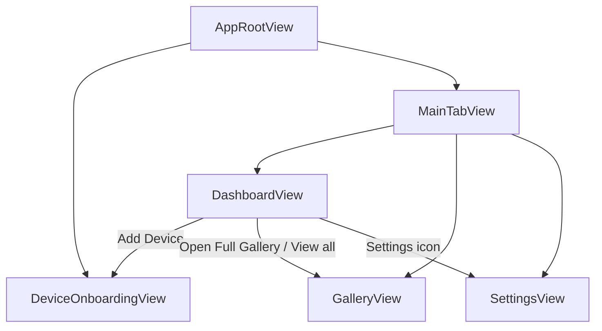

# UI 流程规格

本文件记录当前已落地页面、路由归属和页面跳转关系。只写代码里可确认的长期关系；短期任务写 `../../TASKS.md`。

## 路由归属

- App 根路由由 `AppRouter` 维护：
  - `onboarding`：显示 `DeviceOnboardingView`
  - `main(MainTab)`：显示主 tab 容器
- 主 tab 由 `MainTabView` 维护当前展示页：
  - `dashboard` -> `DashboardView`
  - `gallery` -> `GalleryView`
  - `settings` -> `SettingsView`
- 设置二级页由 `SettingsStore.route` 维护，承载在 `SettingsView` 的 `NavigationView` 内。
- 页面内临时 UI 状态保留在页面或对应 Store 内，不升级为 App 根路由。

## 当前主流程

## Onboarding 流程

- `DeviceOnboardingStore.route` 当前状态：
  - `introduction`
  - `searching`
  - `wifiDetails`
  - `connecting`
  - `success`
- 正向流程：
  - `introduction` -> `searching` -> `wifiDetails` -> `connecting`
  - `connecting` 在 `DeviceSession` ready 后进入 `success`
  - `success` 的 `Go to Home` 回到 `main(.dashboard)`
- 返回和取消：
  - `introduction` 或 `success` 返回 `main(.dashboard)`
  - `searching`、`wifiDetails` 返回 `introduction`
  - `connecting` 返回或取消时 reset `DeviceSession`，回到 `wifiDetails`

## Dashboard 流程

- `DashboardView` 是首页 tab。
- `Add Device` 通过 `AppRouter.showOnboarding()` 进入 onboarding。
- `Open Full Gallery` 和最近事件 `View all` 切到 `main(.gallery)`。
- 设置图标切到 `main(.settings)`。
- 设备抽屉 `DashboardDrawerOverlay` 是首页本地展示状态，不是 App 路由。
- 首次功能引导 `DashboardFeatureSheet` 是 Dashboard Store 状态；展示时隐藏底部 tab。

## Gallery 流程

- `GalleryView` 当前没有 App 级子路由。
- 搜索、筛选、选择模式、批量操作栏和媒体操作面板都由 `GalleryStore` 状态驱动。
- 媒体项点击目前仍停留在相册内部处理，不进入 `PlaybackView` 路由。

## Settings 流程

- `SettingsView` 是设置 tab 根容器。
- `SettingsOverviewView` 可进入：
  - `recordingSettings` -> `RecordingSettingsView`
  - `safetySettings` -> `SafetySettingsView`
  - `storagePolicy` -> `StoragePolicyView`
  - `watermarkConfiguration` -> `WatermarkConfigurationView`
  - `deviceSettings` -> `DeviceSettingsDetailView`
  - `systemPreferences` -> `SystemPreferencesView`
  - `renameDevice` -> `RenameDeviceView`
  - `helpCenter` -> `HelpCenterView`
  - `notificationSettings` -> `NotificationSettingsView`
  - `systemPermissions` -> `SystemPermissionsView`
- `SystemPreferencesView` 还有本地子路由：
  - `notificationSettings`
  - `systemPermissions`
  - `helpCenter`
- `HelpCenterView` 还有本地子路由：
  - `faq`
  - `contactSupport`
- `DeviceSettingsDetailView` 还有本地子路由：
  - `networkIdentity`
  - `firmwareUpdate`
  - `renameDevice`
- 设置二级页展示时隐藏底部 tab；返回通过 `SettingsStore.dismissRoute()` 或本地 nested route 置空。

## 已存在但未接入主路由的页面

- `DeviceListView`
- `LivePreviewView`
- `PlaybackView`
- `DownloadsView`
- `EventsView`

这些页面和对应 Route 文件只表示已有页面骨架或后续入口，不应在文档中标记为主流程已可达。

## 维护规则

- 新增可达页面或路由时，同步更新本文件。
- 只有代码中存在实际跳转入口时，才写入“当前主流程”。
- 临时 sheet、drawer、search、selection 等局部状态只记录归属，不画成 App 路由。
