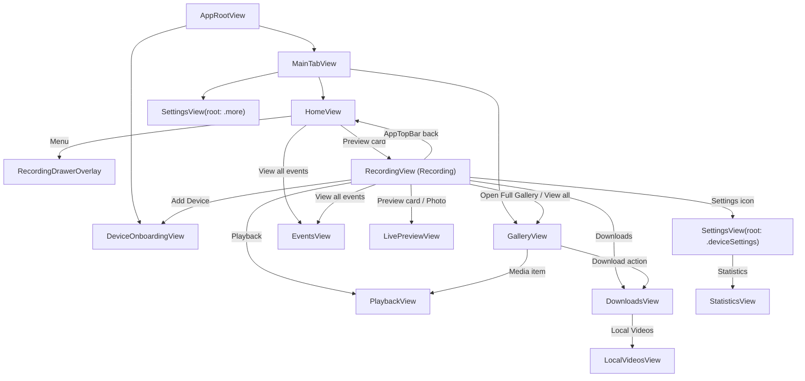

# UI 流程规格

本文件记录当前已落地页面、路由归属和页面跳转关系。只写代码里可确认的长期关系；短期任务写 `../../TASKS.md`。

## 导航归属

- `AppRootView` 维护 onboarding 是否展示；主流程显示 `MainTabView`。
- 主 tab 由 `MainTabView` 本地状态维护当前展示页：
  - `home` -> `HomeView`
  - `gallery` -> `GalleryView`
  - `settings` -> `SettingsView(root: .more)`
- Home、录像页（`RecordingView`）和 Gallery 的跨页面跳转由各自的 `NavigationView` + `NavigationLink` 承载；跳转页展示时隐藏自定义底部 tab。
- 设备设置页由录像页（`RecordingView`）的 `NavigationLink` 承载，root 为 `SettingsView(root: .deviceSettings, embedsNavigationView: false)`。
- 设备设置二级页由 `SettingsStore.route` 维护，复用外层 `NavigationView`。
- 页面内临时 UI 状态保留在页面或对应 Store 内，不升级为 App 根路由。

## 当前主流程

## Onboarding 流程

- `DeviceOnboardingStore.route` 当前状态：
  - `introduction`
  - `searching`
  - `wifiDetails`
  - `connecting`
  - `success`
- 正向流程：
  - `introduction` -> `searching` -> `wifiDetails` -> `connecting`
  - `connecting` 内由 `DeviceOnboardingStore.connectionStage` 区分热点连接、控制通道校验和失败重试提示
  - `connecting` 在 `DeviceSession` ready 后进入 `success`
  - `success` 的 `Go to Home` 关闭 onboarding，回到主 tab 容器
- 返回和取消：
  - `introduction` 或 `success` 关闭 onboarding，回到主 tab 容器
  - `searching`、`wifiDetails` 返回 `introduction`
  - `connecting` 返回或取消时 reset `DeviceSession`，回到 `wifiDetails`

## Home 流程

- `HomeView` 是当前第一 tab 的真正首页，按 `UI/Home.png` 实现离线展示。
- 顶部 `AppTopBar` 菜单展示设备抽屉 `RecordingDrawerOverlay`。
- 主预览卡进入录像页（`RecordingView`）。
- `Recent Events` 的 `View all` 进入 `EventsView`。
- `EventsView` 作为事件型相册列表态，控制通道 ready 后读取 `MEDIA_INDEX(event_only=1)`，并按安全、停车、手动筛选实际事件项；列表项展示缩略图占位、当前项高亮和禁用态更多操作入口，详情/播放/操作菜单仍等待真实媒体链路；首页摘要仍由 `STATE_SYNC(scope=home).recent_events` 或 `RECENT_EVENTS(limit=4)` 提供。
- 首页复用 `RecordingStore` 的设备名称、连接状态和首次功能引导状态；不直接持有 `DeviceSession`。

## 录像页（RecordingView）流程

- `RecordingView` 是设备录像页。
- 从 Home 进入时使用自定义 `AppTopBar` 返回按钮回到 Home，标题和设置按钮同属 `AppTopBar`。
- `Add Device` 通过 `AppRootView` 的 onboarding 状态进入 onboarding。
- `Open Full Gallery` 切到 `main(.gallery)`。
- 预览卡、拍照按钮、回放、下载管理、最近事件 `View all` 通过录像页（`RecordingView`）本地 `NavigationLink` 进入对应页面。
- 设置图标通过录像页（`RecordingView`）本地 `NavigationLink` 进入 `SettingsView(root: .deviceSettings, embedsNavigationView: false)`。
- 录像页左上角不再承载设备抽屉入口。
- 首次功能引导 `RecordingFeatureSheet` 是 Recording Store 状态；展示时隐藏底部 tab。

## Gallery 流程

- `GalleryView` 当前没有 App 级全局路由。
- 搜索、筛选、选择模式、批量操作栏和媒体操作面板都由 `GalleryStore` 状态驱动。
- 控制通道 ready 后，`GalleryStore` 使用 `MEDIA_INDEX` 读取视频列表，并通过 `THUMB_LIST` 消费可用缩略图数据；批量响应遗漏单项时再通过 `THUMB_GET` 补拉。这只覆盖控制协议和列表展示状态。
- 媒体项点击通过 Gallery 的 `NavigationLink` 进入 `PlaybackView`；下载到本机进入 `DownloadsView`。

## Downloads 流程

- `DownloadsView` 当前只消费 `DOWNLOAD_PROGRESS` 事件展示传输进度条、速度和 `completed` 完成记录；暂停、继续、取消、完成项打开和删除只作为禁用态离线壳展示。
- `LocalVideosView` 可从 Downloads 进入，读取 App 已确认保存的本地视频和截图索引，展示存储占用，支持已确认本地视频的系统分享入口，并支持删除前确认后移除索引记录；没有索引时保持空态，不伪造已下载或已截图记录。
- 选择文件、暂停/继续/取消队列、真实保存路径、打开、真实文件存在性和删除本地文件实体仍等待下载任务服务与本地资源保存链路接入。

## Settings 流程

- 第三个 tab `settings` 显示 `SettingsView(root: .more)`，root 内容为标题 `More` 的 `SystemPreferencesView`，不显示返回按钮。
- 录像页设置图标进入 `SettingsView(root: .deviceSettings, embedsNavigationView: false)`，root 内容为 `SettingsOverviewView`，显示返回按钮并 pop 回录像页。
- `SettingsOverviewView` 可进入：
  - `recordingSettings` -> `RecordingSettingsView`
  - `statistics` -> `StatisticsView`
  - `safetySettings` -> `SafetySettingsView`
  - `storagePolicy` -> `StoragePolicyView`
  - `watermarkConfiguration` -> `WatermarkConfigurationView`
  - `deviceSettings` -> `DeviceSettingsDetailView`
  - `firmwareUpdate` -> `FirmwareUpdateView`
  - `systemPreferences` -> `SystemPreferencesView`
  - `renameDevice` -> `RenameDeviceView`
  - `helpCenter` -> `HelpCenterView`
  - `notificationSettings` -> `NotificationSettingsView`
  - `systemPermissions` -> `SystemPermissionsView`
- `SystemPreferencesView` 还有本地子路由：
  - `notificationSettings`
  - `systemPermissions`
  - `helpCenter`
- `HelpCenterView` 还有本地子路由：
  - `faq`
  - `contactSupport`
- `DeviceSettingsDetailView` 还有本地子路由：
  - `networkIdentity`
  - `firmwareUpdate`
  - `renameDevice`
- Home、录像页（`RecordingView`）/ Gallery 的 NavigationLink 目标页不显示底部 tab；录像页使用自定义 `AppTopBar` 返回；More tab 内的 `SystemPreferencesView` 本地子路由保留在主 tab 容器内。
- 返回通过 `SettingsStore.dismissRoute()`、本地 nested route 置空或 NavigationLink selection 置空完成。

## Home / 录像页（RecordingView）/ Gallery 导航目标

- `SettingsView(root: .deviceSettings)`
- `LivePreviewView`
- `PlaybackView`
- `DownloadsView`
- `LocalVideosView`
- `EventsView`
- `DeviceListView`

这些页面已可从 Home、录像页（`RecordingView`）或 Gallery 进入；已定义的聚合读取只到控制协议层，不代表播放器、下载服务、本地保存或真实媒体链路已完成。

`DeviceListView` 从 Home 设备抽屉的 `Manage Devices` 进入，只展示本地已保存设备；设备扫描、Wi-Fi 详情和真实连接结果仍由添加设备流程承载。

## 维护规则

- 新增可达页面或导航目标时，同步更新本文件。
- 只有代码中存在实际跳转入口时，才写入“当前主流程”。
- 临时 sheet、drawer、search、selection 等局部状态只记录归属，不画成 App 路由。
